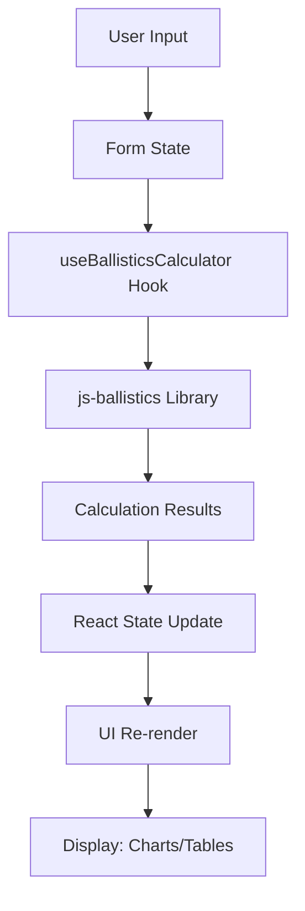
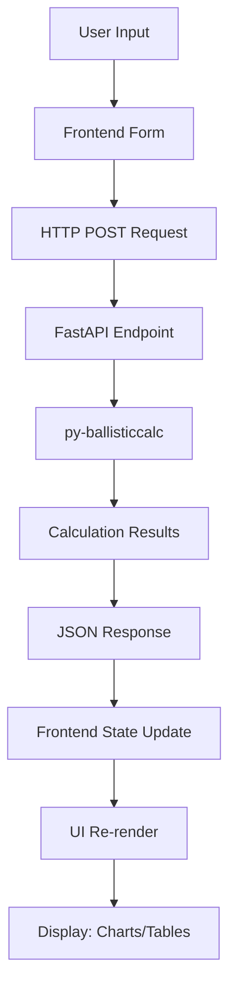

# VAPR Ballistics Architecture

This document provides a high-level overview of the VAPR Ballistics monorepo architecture, design decisions, and system components.

---

## 📋 Table of Contents

1. [Repository Structure](#repository-structure)
2. [Application Architecture](#application-architecture)
3. [Technology Stack](#technology-stack)
4. [Design Philosophy](#design-philosophy)
5. [Data Flow](#data-flow)
6. [Deployment Architecture](#deployment-architecture)
7. [Future Roadmap](#future-roadmap)

---

## 🗂️ Repository Structure

### Monorepo Organization

```
vapr-ballistics/
├── apps/                       # Applications
│   ├── js-client/             # Client-only ballistics calculator
│   └── fastapi-fullstack/     # Full-stack Python + React app
├── packages/                   # Shared packages (future)
├── docs/                       # Documentation
│   └── guides/                # Development guides
├── scripts/                    # Build and deployment scripts
└── .github/                    # CI/CD and templates
```

**Why monorepo?**

- ✅ Single source of truth for related projects
- ✅ Shared configuration and tooling
- ✅ Easier cross-app refactoring
- ✅ Unified versioning and releases

**Tool:** [Turborepo](https://turbo.build/) v2.5.8 for build orchestration and caching

---

## 🏗️ Application Architecture

### 1. js-client (Pure Client-Side)

**Purpose:** Standalone ballistics calculator that runs entirely in the browser

#### Architecture

```
┌─────────────────────────────────────────┐
│         Browser (Next.js 16)            │
│  ┌───────────────────────────────────┐  │
│  │   React Components (UI Layer)     │  │
│  │  - BallisticsCalculator.tsx       │  │
│  │  - Charts, Forms, Tables          │  │
│  └───────────────────────────────────┘  │
│                  ↓                      │
│  ┌───────────────────────────────────┐  │
│  │  Custom Hooks (Business Logic)    │  │
│  │  - useBallisticsCalculator.ts     │  │
│  └───────────────────────────────────┘  │
│                  ↓                      │
│  ┌───────────────────────────────────┐  │
│  │   js-ballistics Library           │  │
│  │   v2.2.0-beta.2 (via npm)         │  │
│  │  - Pure TypeScript calculations   │  │
│  └───────────────────────────────────┘  │
└─────────────────────────────────────────┘
```

#### Key Features

- **Zero backend** - No server required
- **Static export** - Deployed as static HTML/CSS/JS
- **Offline capable** - Runs without internet (after initial load)
- **Fast** - No network latency for calculations

#### Technology Stack

- **Framework:** Next.js 16 (React 19)
- **Language:** TypeScript
- **Ballistics Engine:** [js-ballistics](https://github.com/robsdevcraft/js-ballistics) v2.2.0-beta.2
- **Styling:** Tailwind CSS + shadcn/ui components
- **Charts:** Recharts
- **Build Output:** Static HTML

#### Data Flow

```
User Input → React State → js-ballistics → Calculation Results → UI Update
```

No server communication - all calculations happen in-memory.

---

### 2. fastapi-fullstack (Full-Stack Application)

**Purpose:** Comprehensive ballistics system with backend API and frontend UI

#### Architecture

```
┌────────────────────────┐
│   Frontend (React)     │
│  - Next.js 16          │
│  - Ballistics UI       │
│  - API Client          │
└────────────────────────┘
           ↓ HTTP/REST
┌────────────────────────┐
│   Backend (FastAPI)    │
│  - REST API            │
│  - py-ballisticcalc    │
│  - CORS enabled        │
└────────────────────────┘
           ↓ (future)
┌────────────────────────┐
│   Database (optional)  │
│  - Store profiles      │
│  - User data           │
└────────────────────────┘
```

#### Key Features

- **Backend API** - FastAPI server with REST endpoints
- **Separate frontend** - React app that calls API
- **Docker-based** - Frontend + Backend in separate containers
- **Extensible** - Can add database, authentication, etc.

#### Technology Stack

**Backend:**

- **Framework:** FastAPI
- **Language:** Python 3.11+
- **Ballistics Engine:** [py-ballisticcalc](https://github.com/o-murphy/py-ballisticcalc) v2.2.6.post1+
- **Server:** Uvicorn
- **Containerization:** Docker

**Frontend:**

- **Framework:** Next.js 14 (React 18)
- **Language:** TypeScript
- **API Client:** Fetch API
- **Styling:** Tailwind CSS + shadcn/ui

#### Data Flow

```
User Input → Frontend Form
     ↓
Frontend sends HTTP request
     ↓
Backend API endpoint (/api/ballistics/calculate)
     ↓
py-ballisticcalc performs calculation
     ↓
JSON response → Frontend
     ↓
Display results in UI
```

---

## 🛠️ Technology Stack

### Shared Technologies

| Category            | Technology   | Version | Purpose                                    |
| ------------------- | ------------ | ------- | ------------------------------------------ |
| **Monorepo**        | Turborepo    | 2.5.8   | Build orchestration, caching               |
| **Package Manager** | pnpm         | 10.18.1 | Fast, disk-efficient dependency management |
| **Styling**         | Tailwind CSS | 3.4.x   | Utility-first CSS framework                |
| **UI Components**   | shadcn/ui    | Latest  | Pre-built accessible components            |
| **Linting**         | ESLint       | 9.x     | Code quality (bug catching)                |
| **Formatting**      | Prettier     | 3.x     | Code formatting (style enforcement)        |
| **Type Safety**     | TypeScript   | 5.7.x   | Static type checking                       |

### Application-Specific

#### js-client

| Category       | Technology                 | Purpose                            |
| -------------- | -------------------------- | ---------------------------------- |
| **Framework**  | Next.js 16                 | React framework with static export |
| **Ballistics** | js-ballistics 2.2.0-beta.2 | Pure JS/TS ballistics calculations |
| **Charts**     | Recharts                   | Trajectory visualization           |
| **Theme**      | next-themes                | Dark/light mode                    |

#### fastapi-fullstack

| Category       | Technology                    | Purpose                               |
| -------------- | ----------------------------- | ------------------------------------- |
| **Backend**    | FastAPI                       | High-performance Python API framework |
| **Ballistics** | py-ballisticcalc 2.2.6.post1+ | Python ballistics engine              |
| **Server**     | Uvicorn                       | ASGI server                           |
| **Frontend**   | Next.js 14                    | React frontend for API consumption    |
| **Container**  | Docker                        | Isolated deployments                  |

---

## 🎯 Design Philosophy

### Core Principles

1. **Separation of Concerns**
   - UI components separate from business logic
   - Business logic separate from ballistics calculations
   - Backend and frontend are independent

2. **Type Safety First**
   - TypeScript everywhere
   - Explicit types for function parameters and returns
   - Minimal use of `any` or type assertions

3. **User Experience**
   - Fast load times (static export for js-client)
   - Responsive design (mobile-first)
   - Accessible (keyboard navigation, ARIA labels)
   - Theme support (dark/light mode)

4. **Developer Experience**
   - Clear project structure
   - Comprehensive documentation
   - Automated formatting and linting
   - Fast development cycles (Turbo + pnpm)

5. **Maintainability**
   - Conventional commits for clear history
   - SemVer for predictable versioning
   - Automated changelogs
   - Comprehensive testing (future)

### Why Two Apps?

**js-client advantages:**

- ✅ Zero deployment cost (static hosting)
- ✅ Instant calculations (no network latency)
- ✅ Offline capable
- ✅ No server maintenance

**fastapi-fullstack advantages:**

- ✅ Centralized logic (easier to update)
- ✅ Can add database for profiles
- ✅ Can add authentication
- ✅ More control over calculations
- ✅ Future extensibility

**Use case:**

- **js-client** - Quick calculator, public use
- **fastapi-fullstack** - Feature-rich application, user accounts, data persistence

---

## 🔄 Data Flow

### js-client Data Flow



**Key Points:**

- All state managed by React
- No external API calls
- Calculations happen synchronously
- Results stored in component state

### fastapi-fullstack Data Flow



**Key Points:**

- Frontend and backend communicate via REST API
- Backend is stateless (no session management yet)
- CORS enabled for cross-origin requests
- JSON for data exchange

---

## 🚀 Deployment Architecture

### js-client Deployment

**Recommended:** Static hosting platforms

```
┌─────────────────────────────────────┐
│     CDN / Static Hosting            │
│  (Vercel, Netlify, GitHub Pages)    │
│                                     │
│  ┌───────────────────────────────┐  │
│  │  index.html (Entry Point)     │  │
│  │  _next/static/... (JS/CSS)    │  │
│  │  Public assets                │  │
│  └───────────────────────────────┘  │
└─────────────────────────────────────┘
           ↓
     User's Browser
```

**Build Output:** Static HTML, CSS, JS
**Deployment:** `pnpm build` → `out/` directory → Upload to hosting

**Hosting Options:**

- **Vercel** (recommended) - Zero config, automatic deployments
- **Netlify** - Similar to Vercel
- **GitHub Pages** - Free for open source
- **AWS S3 + CloudFront** - Scalable, cost-effective

### fastapi-fullstack Deployment

**Recommended:** Docker containers

```
┌─────────────────────────────────────┐
│      Docker Host / Cloud            │
│                                     │
│  ┌──────────────┐  ┌──────────────┐ │
│  │   Frontend   │  │   Backend    │ │
│  │  (Next.js)   │  │  (FastAPI)   │ │
│  │  Port 3000   │  │  Port 8000   │ │
│  └──────────────┘  └──────────────┘ │
│         ↓                  ↓        │
│  ┌────────────────────────────────┐ │
│  │      Nginx (Reverse Proxy)     │ │
│  │         Port 80/443            │ │
│  └────────────────────────────────┘ │
└─────────────────────────────────────┘
           ↓
     User's Browser
```

**Deployment Options:**

- **Docker Compose** (development/self-hosted)
- **AWS ECS** (production, scalable)
- **Google Cloud Run** (serverless containers)
- **DigitalOcean App Platform** (simple deployment)

**Components:**

1. **Frontend container** - Serves Next.js app
2. **Backend container** - Runs FastAPI + Uvicorn
3. **Nginx** - Reverse proxy, SSL termination (optional)

---

## 🔮 Future Roadmap

### Planned Features

#### Short-term (1-3 months)

- [ ] Add comprehensive test coverage (Vitest + Playwright)
- [ ] Implement user profiles (save/load settings)
- [ ] Add more ballistics features (wind deflection, Coriolis effect)
- [ ] Improve chart interactivity (zoom, pan, tooltips)
- [ ] Add export to PDF functionality

#### Medium-term (3-6 months)

- [ ] Create shared package for common utilities (`@vapr/shared`)
- [ ] Add authentication to fastapi-fullstack (JWT)
- [ ] Implement database for user data (PostgreSQL)
- [ ] Create mobile app (React Native or PWA)
- [ ] Add internationalization (i18n)

#### Long-term (6-12 months)

- [ ] Real-time collaboration features
- [ ] Advanced analytics and insights
- [ ] Machine learning for trajectory prediction improvements
- [ ] Integration with external ballistics APIs
- [ ] Desktop app (Electron or Tauri)

### Architectural Improvements

- [ ] **Shared packages** - Extract common code to `packages/` directory
  - `@vapr/shared` - Utilities, types, constants
  - `@vapr/ui` - Shared UI components
  - `@vapr/ballistics-types` - TypeScript types for both engines

- [ ] **Testing infrastructure** - Comprehensive testing across apps
  - Unit tests (Vitest)
  - Integration tests (Supertest for API)
  - E2E tests (Playwright)

- [ ] **Observability** - Monitoring and logging
  - Error tracking (Sentry)
  - Analytics (Plausible or self-hosted)
  - Performance monitoring (Web Vitals)

- [ ] **Database layer** - For fastapi-fullstack
  - PostgreSQL for relational data
  - Redis for caching (optional)
  - Prisma or SQLAlchemy for ORM

- [ ] **Authentication** - User management
  - JWT-based authentication
  - OAuth providers (Google, GitHub)
  - Role-based access control (RBAC)

---

## 📚 Additional Resources

- [Project README](../README.md) - Overview and quick start
- [Workflow Guide](./guides/workflow.md) - Development workflow
- [Contributing Guide](../CONTRIBUTING.md) - How to contribute
- [js-ballistics](https://github.com/robsdevcraft/js-ballistics) - Client-side ballistics engine
- [py-ballisticcalc](https://github.com/o-murphy/py-ballisticcalc) - Python ballistics engine

---

## 🤔 Design Decisions

### Why Next.js for both apps?

**Consistency:** Same framework = shared knowledge, tooling, and patterns
**Flexibility:** Can be used for static export (js-client) or server-side (future)
**Ecosystem:** Large community, excellent documentation, great DX

### Why separate ballistics engines?

**Language differences:** js-ballistics (TypeScript) vs py-ballisticcalc (Python)
**Use case:** js-ballistics optimized for browser, py-ballisticcalc for server
**Future:** May unify or create WASM version for both

### Why Turborepo over other monorepo tools?

**Performance:** Intelligent caching and parallel execution
**Simplicity:** Less configuration than Nx
**Integration:** Works seamlessly with pnpm
**Future:** Can scale to more apps/packages easily

### Why Docker for fastapi-fullstack?

**Isolation:** Backend and frontend in separate containers
**Portability:** Run anywhere Docker runs
**Development parity:** Same environment locally and in production
**Scalability:** Easy to add more services (database, cache, etc.)

---

_This architecture is a living document. As the project evolves, so will this guide._
